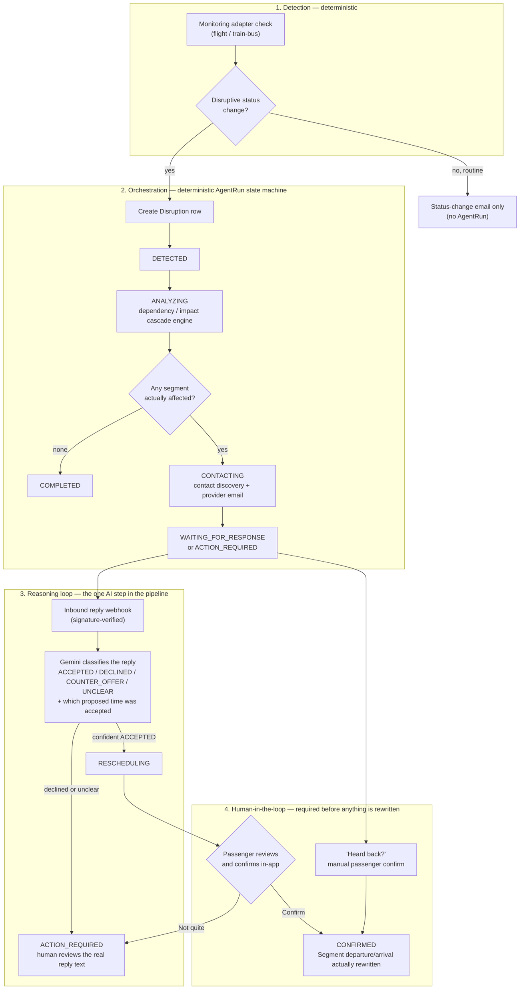

# Maestravl Travel Intelligence Engine — Architecture

This document explains how the itinerary ingestion, editing, and monitoring
system is put together, and why. It's the map for anyone (human or agent)
picking this up next.

## Pipeline overview

```
Upload (PDF/JPEG/PNG/WEBP)
  → File validation (magic bytes, size, embedded-script check)
  → Encrypt at rest, store outside /public
  → Text extraction (native PDF text, falling back to OCR)
  → Rule-based parser (regex + dictionaries + NLP dates) → confidence-scored fields
  → Normalization → canonical Segment schema
  → Save to DB (Trip, Passenger, Segment, Document, MonitoringRecord)
  → Monitoring adapter registry initializes a (currently unconnected) MonitoringRecord
  → User reviews/edits low-confidence fields in the UI
```

Each stage is an independently swappable module under `lib/`:

| Stage | Location |
|---|---|
| File validation | `lib/security/fileValidation.ts` |
| Encryption at rest | `lib/security/encryption.ts` |
| Native PDF text | `lib/extraction/pdfText.ts` |
| OCR | `lib/extraction/ocr.ts` |
| Extraction orchestration | `lib/extraction/extractText.ts` |
| Entity extraction / parsing | `lib/extraction/parse.ts` |
| Normalization | `lib/extraction/normalize.ts` |
| Monitoring abstraction | `lib/monitoring/` |

## Why no paid AI API

Extraction is built entirely from free, open-source, self-hosted pieces —
no per-request API costs, no rate limits, no third-party data-sharing:

- **`pdfjs-dist`** (Mozilla, Apache-2.0) reads a PDF's native text layer when
  one exists. This is the common case for e-tickets/confirmations and is
  100% accurate — no OCR needed.
- **`tesseract.js`** (Apache-2.0) runs OCR locally (no network calls) when
  there's no text layer — scanned documents, photos of paper tickets,
  screenshots.
- **`chrono-node`** (MIT) parses natural-language dates/times ("Dec 15, 2026
  2:30 PM") into real `Date` objects.
- A hand-written **rule-based entity extractor** (`lib/extraction/parse.ts`)
  finds flight numbers, airport codes, confirmation numbers, seats, gates,
  prices, and passenger names via regex + the airline/airport dictionaries
  in `lib/data/`.

This trades some flexibility (arbitrary phrasing an LLM might catch, this
parser might miss) for zero cost and zero external dependency. If a paid LLM
becomes available later, it slots in as an alternative implementation of the
same `parseItinerary(text) → ExtractedItinerary` contract in
`lib/extraction/parse.ts` — nothing else in the pipeline needs to change.

## Confidence scoring

Every extracted field carries a `{ value, confidence, source }` triple
(`lib/extraction/types.ts`). Confidence is assigned per extraction method:

- Dictionary match (airline/airport code recognized) → 85-95
- Regex match on a labeled field ("Confirmation Number: XJ7K2P") → 78-90
- NLP date parse with both date and time certain → 80
- NLP date parse with only a date → 55
- Heuristic keyword guess (transport type from context) → 30-65

Fields below `CONFIDENCE_REVIEW_THRESHOLD` (70) are surfaced in the editor
UI for the user to confirm. Editing a field via the API
(`PATCH /api/segments/[id]`) removes it from the confidence map entirely —
a user-confirmed value is never second-guessed again.

## Monitoring abstraction

`lib/monitoring/types.ts` defines one interface, `MonitoringAdapter`, that
every transport type implements:

```
MonitoringAdapter
  ├─ flightAdapter   (lib/monitoring/adapters/flightAdapter.ts) — real
  │    └─ rotates across flight/aviationStack.ts, flight/aeroDataBox.ts —
  │       see "Scheduled monitoring checks" in docs/INTEGRATION.md
  ├─ trainAdapter    (lib/monitoring/adapters/trainAdapter.ts) — real
  ├─ busAdapter      (lib/monitoring/adapters/busAdapter.ts) — real
  │    └─ both are the transitland/ factory (see below), gtfsRouteType
  │       is the only difference between them
  ├─ boatAdapter     (covers ferry, cruise, boat) — stub
  └─ taxiAdapter     (covers taxi, rental car) — stub
```

`lib/monitoring/registry.ts` maps a `TransportType` to its adapter. Adding a
new provider or transport mode means writing one adapter and adding it to
the registry — nothing else in the app changes. `flightAdapter` is itself a
small rotator rather than a single provider: free-tier flight-status APIs
cap out too low individually to cover more than a couple of trips a month,
so it spreads checks across every *configured* provider in
`lib/monitoring/adapters/flight/`, tracking spend per provider per calendar
month in the `ProviderUsage` table and falling through to the next provider
once one runs dry (or errors). Adding another provider means writing one
`FlightProviderAdapter` (see `flight/types.ts`) and listing it in
`flightAdapter.ts`'s `PROVIDERS` array.

**Train/bus (`lib/monitoring/adapters/transitland/`):** backed by
[Transitland](https://transit.land), a free-tier (10,000 REST queries/month)
aggregator of GTFS/GTFS-realtime for 55+ countries — one `TRANSITLAND_API_KEY`
covers both. `createTransitlandAdapter({ id, supports, gtfsRouteType })` in
`transitlandAdapter.ts` is the shared factory; `trainAdapter.ts`/`busAdapter.ts`
are one-line instantiations (`gtfsRouteType: 2` rail / `3` bus, per the GTFS
spec — a best-effort filter, not exhaustive). `check()`: search Transitland
operators for `segment.provider`, search that operator's routes for
`segment.identifier` (both matched via the pure, unit-tested
`pickBestOperatorMatch`/`pickBestRouteMatch` in `matching.ts` — normalized
substring matching that returns `null` rather than guessing a low-confidence
match), then classify the matched route's active GTFS-RT alerts
(`classifyAlerts` — prefers the structured `effect` field, falls back to
text-keyword matching, only fills `delayMinutes` when an explicit figure is
in the alert text, never fabricated). Quota tracked via the same
`ProviderUsage` table/helpers (`flight/usage.ts`) flights already use, under
`provider: 'transitland'`.

The real constraint isn't the API, it's the data: `lib/extraction/parse.ts`
only ever fills `identifier`/`provider` for flight-number-shaped text, so an
auto-extracted TRAIN/BUS segment has both null and the adapter honestly
reports `noMatch` with a message telling the passenger to fill in the
operator + train/bus number (Edit) — real monitoring only starts once a
human does that. This mirrors how AeroDataBox's `noMatch` already works for
a flight the provider simply doesn't carry, extended to a broader "not
enough identifying data yet" case.

**Rental car / taxi / ferry / cruise: still stubs.** Researched this session
— no free, self-serve status API exists for rental cars or taxi dispatch
(Avis/Booking.com/OpenNDC are all partner-agreement-gated); ferry/cruise
operators mostly don't expose public APIs at all. See `docs/INTEGRATION.md`
for what was checked, so it isn't re-researched from scratch later.
`taxiAdapter.ts`/`boatAdapter.ts`'s `isConfigured()` still checks an env var
purely to phrase an honest "not connected" message — there's no real
provider behind either, and `/system-health` reports both as "not
implemented" rather than merely unconfigured.

## Data model

Status/type fields (`Trip.status`, `Segment.transportType`, `Segment.status`,
`Document.status`, `MonitoringRecord.status`) are plain `String` columns
rather than native Postgres enums, so adding a new value never needs a
migration. The canonical value lists live in `lib/constants.ts` — import
from there rather than hard-coding string literals, and validation happens
via `zod` in the API route handlers (Prisma won't reject an invalid value
on its own).

## Security

- Uploaded files are AES-256-GCM encrypted (`lib/security/encryption.ts`)
  before being uploaded to a *private* Supabase Storage bucket
  (`lib/storage.ts`) — there is no public URL that could ever serve one
  directly. The only way to read a document back is
  `GET /api/documents/[id]/file`, which checks the requesting user owns it,
  then decrypts on the fly.
- File type is verified by magic bytes, not by trusting the client's
  `Content-Type` header or filename extension.
- PDFs containing `/JavaScript`, `/JS`, or `/OpenAction` are rejected
  outright.
- Auth is credential-based (email + bcrypt-hashed password) via Auth.js,
  JWT sessions, no third-party OAuth dependency.
- Every API route re-derives the session server-side and checks resource
  ownership (`trip.userId === session.user.id`) before reading or writing
  anything — there's no client-trusted user id anywhere.

## Agentic recovery (in progress)

The models and logic backing autonomous disruption recovery (spec: a
disrupted segment should trigger Maestravl to work out what's affected and
coordinate a fix, not just email the passenger that something changed).
Built incrementally — this section reflects what's actually implemented,
not the target end-state.

**Agentic workflow, end to end:**



Mapped to how this pipeline is usually talked about: the **agent** is the
`AgentRun` orchestrator (`lib/agents/orchestrator.ts`) plus the specialized
functions it calls (contact discovery, message composition, alternative
ranking) — each independently pure/tested where possible. The
**orchestration** is the state machine itself, resumable by construction
(a serverless cold start or crash just leaves the run wherever it last
got to, since `AgentRun.status` in the database *is* the execution state,
not something held in memory). The **reasoning loop** is deliberately
narrow — one scoped LLM call (Gemini) whose only job is reading what a
reply *means*, not deciding what to do about it; `decideRunTransition`
(pure, unit-tested) makes that decision. **Human-in-the-loop** gates
appear at exactly the points where money or a passenger's schedule would
actually change: nothing auto-books, auto-pays, or auto-rewrites a
segment's time without an explicit confirm, and every autonomous step
that *did* happen is logged as a plain-language `AgentAction` a human can
read and audit.

**Why one orchestrating agent, not several coordinating ones:** this
pipeline is deliberately a single orchestrator calling purpose-built,
independently-tested specialists — not a set of autonomous agents
negotiating with each other. Multi-agent-to-agent coordination was
considered and rejected for this workflow specifically: chaining several
LLM-driven agents (e.g. a "contact-finder agent" talking to a
"message-drafting agent") would add latency, cost, and a new failure mode
(one agent misinterpreting another's output) at every hop, for a task
where the actual hard part — cascade math, contact confidence scoring,
template composition — has a single deterministically correct answer, not
one that benefits from negotiation between models. The one place this
pipeline *does* need a model is reading unstructured human language (a
reply, a spoken question), and each of those is a single scoped call, not
a conversation between agents.

**Computational efficiency:** exactly two AI calls exist in the entire
codebase (`replyInterpretation.ts`'s Gemini call, the voice assistant's
Groq call), both single-purpose, both free-tier by construction (see
`docs/DATA_SOURCES.md`) — there is no chain-of-agent-calls cost to budget
for. The recovery pipeline itself does no polling of its own; it runs
once per monitoring check (see "Monitoring abstraction" above) and again
only when a real reply arrives, not on a timer.

**Technical scalability:** `AgentRun.status` in the database *is* the
run's execution state (see "Detection → orchestration pipeline" below) —
there is no in-memory process to keep alive, so horizontal scaling is
"run more instances of the same stateless handler," not a rearchitecture.
The genuine current bottleneck is upstream: free-tier third-party quotas
(Gemini ~20 req/day, AviationStack's monthly cap) are the actual ceiling
on throughput today, not this codebase's own design — see
`docs/DATA_SOURCES.md` for what each provider's real tier allows.

**Data model** (`prisma/schema.prisma`, "Agentic recovery" section):
`Disruption` (a detected status change worth acting on) → `AgentRun` (one
resolution attempt, state-machine `status` from `DETECTED` through
`COMPLETED`) → `AgentAction` (the step-by-step audit log an `AgentRun`
produces — this is also what the passenger-facing recovery timeline will
read from). `ProviderContact`, `Communication`, `RescheduleRequest`, and
`Alternative` round out the workflow: who to contact, what was said, what
new time was requested, and what ranked alternatives exist if the original
can't be recovered.

There is deliberately **no persisted `Dependency` table**. Which segments
are downstream of a disrupted one is fully derivable from each segment's
own `order`/time fields, so it's computed on demand (see below) rather than
stored and risking drift whenever a segment's schedule is edited.

**Dependency/impact engine** (`lib/dependency/graph.ts`): pure,
deterministic logic — no AI, no I/O — matching spec section 17's
instruction to build deterministic tests before adding AI reasoning on top.
Given a trip's segments, which one was disrupted, and a delay in minutes,
`calculateImpact` walks every segment scheduled after it and classifies
each as:

- **DIRECT** — the disruption-shifted timeline conflicts with this
  segment's scheduled start (an outright missed connection).
- **POTENTIAL** — buffer shrinks to within `WARNING_BUFFER_MINUTES` (120,
  tunable) but doesn't break outright.
- **UNAFFECTED** — enough buffer absorbs the shift.

The cascade math mirrors how airlines reason about missed connections: each
segment's *actual* start is `max(its own scheduled start, the previous
segment's actual end)`, and its actual end preserves its own original
duration from there — so a large enough gap anywhere in the chain lets
later segments return to their originally scheduled times rather than
staying perpetually "behind." Segments with missing schedule data are
reported as `POTENTIAL` with a null buffer rather than silently assumed
unaffected (spec section 20: never fake a result you don't have).

**Detection → orchestration pipeline (built):**

```
runMonitoringCheck (lib/monitoring/service.ts)
  → status change? → classifyDisruption (lib/agents/classify.ts)
      → disruptive? → handleDisruptionDetection (lib/agents/detect.ts)
          → creates Disruption row
          → startAgentRun (lib/agents/orchestrator.ts)
              → creates AgentRun (status DETECTED)
              → claims it (DETECTED -> ANALYZING, guards re-entrant calls)
              → planAnalysis (lib/agents/analyze.ts) — pure: runs the
                dependency engine, decides what's affected
              → logs one AgentAction per plan step
              → nothing affected? → AgentRun.status -> COMPLETED
              → something affected? → status -> CONTACTING, then per
                affected segment:
                  → findOrDiscoverContact (lib/agents/contact.ts)
                  → logs FIND_CONTACT
                  → usable email contact? → compose + send a request
                    (lib/agents/message.ts + sendProviderEmail) → logs
                    CONTACT_PROVIDER, creates Communication; a DIRECT
                    impact with a concrete shiftedStart also creates a
                    RescheduleRequest and logs REQUEST_RESCHEDULE
                  → no usable contact? → logs ESCALATE
              → sendDisruptionImpactEmail (one, summarizing every
                affected segment and whether it was actually contacted)
              → AgentRun.status -> WAITING_FOR_RESPONSE | ACTION_REQUIRED
```

`classifyDisruption` filters out routine progression (ON_TIME → BOARDING →
DEPARTED → ARRIVED) and short delays (< `DISRUPTION_DELAY_THRESHOLD_MINUTES`,
30 by default) — those still get the existing plain status-change email,
just no `Disruption`/`AgentRun`.

**Contact discovery** (`lib/agents/contactDiscovery.ts` — pure — wrapped by
`lib/agents/contact.ts` for persistence): per spec section 5, "the
itinerary should be the first source of contact information." First scans
text Maestravl already has — a segment's `notes` and its source document's
`extractedRawText` — for email addresses, URLs, and phone numbers via
regex, scoring confidence higher when a match sits near a keyword like
"contact" or "reservations." Every match is persisted as a
`ProviderContact` (source tagged `ITINERARY` or `BOOKING_CONFIRMATION`)
even at low confidence, for audit purposes — but `isAutoContactable` only
allows automatic contact for an `EMAIL` channel at confidence ≥
`MIN_AUTO_CONTACT_CONFIDENCE` (70). Anything else (a bare phone number, a
low-confidence email, a booking portal URL Maestravl can't submit a form
to) gets recorded and escalated, never acted on.

Only if that local search finds *nothing* — and only if `segment.provider`
is known and `MINIMAX_API_KEY` is configured — does `findOrDiscoverContact`
fall back to a web search via MiniMax's `web_search` Server Tool
(`lib/agents/minimaxSearch.ts`, source tagged `WEB_LOOKUP`). This is the
only one of the team's four existing resources (Boardy, MiniMax,
OllyGarden, Nebius) that turned out to actually offer a search capability
— Boardy is a networking agent, OllyGarden is an observability tool,
Nebius is LLM inference hosting with no search/grounding product found.
MiniMax's is a genuinely paid tool call (reported ~$0.01/request, beta),
not a free-tier API — every other currently-marketed "free" search API was
checked and ruled out as of Aug 2026 (Brave's free tier was discontinued
Feb 2026; Google Custom Search JSON API is closed to new signups). A
segment only ever triggers this once — a discovered contact (or the
confirmed absence of one) is persisted and never re-searched.

Web results get *rescaled* confidence, not trusted at face value —
`discoverContactsInWebResults` only lets a result clear the
auto-contactable threshold if its own domain plausibly matches the
provider's name (a real, if weak, "official source" signal); anything from
an unrelated domain — a booking aggregator mentioning the same email, for
instance — is capped well under `MIN_AUTO_CONTACT_CONFIDENCE` regardless of
how confident the text pattern itself looked, per spec section 5: "do not
use suspicious third-party contact details when an official source is
available."

**Communication** (`lib/agents/message.ts` — pure templates, no LLM, same
philosophy as the rest of this pipeline — sent via `sendProviderEmail` in
`lib/email.ts`, the only real outbound channel this codebase has):
`composeRescheduleRequest` asks for a specific new time (used when the
dependency engine produced a `shiftedStart` — a DIRECT impact from a
delay); `composeAwarenessInquiry` is a softer, non-committal heads-up used
for a POTENTIAL impact or a cancellation's downstream segments, where
there's no single new time to propose. Neither template ever uses
confirmed/changed language — spec section 6: "Messages must NEVER claim
something has been confirmed when it has only been requested."

**Honesty boundary (spec section 20):** an `AgentRun` only reaches
`WAITING_FOR_RESPONSE` when *every* affected segment actually got a
request sent — a real `Communication` row with `status: 'SENT'`, not a
best-effort attempt. If even one affected segment couldn't be contacted
(no usable contact found, or the send failed), the run lands in
`ACTION_REQUIRED` instead, and the passenger email says exactly which
segments Maestravl reached out to and which it couldn't, rather than a
blanket "handled" or "not handled." `COMPLETED` is reserved for the case
where nothing downstream was affected at all.

**Risk policy** (`lib/agents/policy.ts`): every `AgentAction` is classified
LOW/MEDIUM/HIGH via `classifyActionRisk` before it's logged;
`canAutoExecute` gates whether it runs immediately (`EXECUTED`) or stops
for approval (`REQUIRES_APPROVAL`). `CONTACT_PROVIDER`/`REQUEST_RESCHEDULE`
are LOW at baseline (asking isn't committing — spec section 9's LOW list)
but `logAction` accepts an explicit status override so a failed send is
recorded as `FAILED`, not a policy-derived `EXECUTED`, regardless of risk
tier — risk tier and real outcome are tracked separately on purpose. The
MEDIUM/HIGH paths (a reschedule with a fee, a non-refundable cancellation)
are implemented in the policy module but have no caller yet, since nothing
proposes a reschedule *with a fee* until a provider's reply is processed.

**Provider replies** — two paths, both real, neither faked:

- *Manual* (`app/api/agent-runs/[id]/resolve`, the "Heard back?" button on
  `BoardingPass.tsx`): the passenger tells Maestravl themselves that
  a provider responded (by phone/text/whatever), with an optional note.
  Moves the run straight to `CONFIRMED` — the passenger is asserting
  resolution, not Maestravl inferring it.
- *Automatic* (`lib/agents/inboundReply.ts` + `app/api/webhooks/resend-inbound`,
  opt-in via `RESEND_INBOUND_DOMAIN`/`RESEND_WEBHOOK_SECRET`): every
  provider-facing email's `Reply-To` is a per-`Communication` address
  (`lib/inboundReplyAddress.ts`, `reply+<communicationId>@<inbound-domain>`)
  — Resend has no documented reply-threading headers, so this address *is*
  the correlation mechanism. When a reply lands, the webhook (signature
  verified via `resend.webhooks.verify`, Svix under the hood) fetches the
  full body (`resend.emails.receiving.get` — the webhook payload itself is
  metadata-only), strips the quoted thread history
  (`lib/agents/replyText.ts`, best-effort — catches "On ... wrote:" and
  "> "-quoted blocks, not every client's convention), and records it as an
  inbound `Communication`.

  Never moves straight to `CONFIRMED` — see "Reply interpretation" below
  for what it does move to and why that's still not the same as claiming
  resolution.

  **Live-verified in production, 2026-08-13** (not just unit tested): a
  real outbound email round-tripped through a real reply, the webhook
  correctly matched it back via the per-`Communication` Reply-To address,
  `classifyReply` read it as `ACCEPTED`, and a human confirm actually
  rewrote the segment's departure/arrival time. `/system-health`'s
  `email-inbound` row reflects this ongoing (2 inbound replies on record
  as of 2026-09-02).

**Reply interpretation (`lib/agents/replyInterpretation.ts`):** the one
deliberate exception to this codebase's "deterministic logic first, no LLM
in the loop" rule (see the "Why no paid AI API" section above and the
header comments on `analyze.ts`/`classify.ts`/`message.ts`) — reading what
a reply actually *means* is genuine language understanding, not something
a regex can do. Uses free-tier Gemini (`gemini-3.6-flash`, `GEMINI_API_KEY`)
directly — this used to share the same free-tier account as the voice
assistant, but the voice assistant has since moved to Groq (see "Voice
assistant" below) specifically because Gemini's ~20-requests/day working
limit couldn't cover both; reply interpretation is now Gemini's only
consumer, so budget it accordingly if that changes again.

Split pure/impure the same way `replyText.ts`/`inboundReply.ts` already
are: `classifyReply` is the only network call (Gemini, structured JSON
output constrained to `ACCEPTED | DECLINED | COUNTER_OFFER | UNCLEAR` plus
a confidence score) and never throws — any failure (no `GEMINI_API_KEY`,
timeout, malformed output) degrades to `UNCLEAR`, exactly the pipeline's
behavior before this feature existed, so a broken classifier can never
make anything worse than not having one. `decideRunTransition` is pure and
unit-tested (`replyInterpretation.test.ts`) — it's what actually decides
the `AgentRun`'s next status, keeping that decision as deterministic and
auditable as the rest of the pipeline; only the reading-comprehension step
is AI.

Even a confident `ACCEPTED` read only reaches `RESCHEDULING`, never
`CONFIRMED` directly — spec section 20, never claim a resolution that
wasn't verified. `RESCHEDULING` surfaces a prompt on `BoardingPass.tsx`
with the interpreted summary, a link to the real reply text (via
`GET /api/agent-runs/[id]/communications`), and two buttons: "Confirm —
update itinerary" or "Not quite — keep working on it". Only an explicit
passenger confirm
(`app/api/agent-runs/[id]/confirm-reschedule`) moves the run to
`CONFIRMED` and actually rewrites the segment's `departureTime`/
`arrivalTime` (shifted by the same delta, so trip duration stays
consistent) — the first and only place a recovery run's own action ever
mutates a segment's scheduled time (`detect.ts`/`monitoring/service.ts`
deliberately never do, layering live status on top instead). That's safe
specifically because it's gated behind the same human-confirmation trust
boundary as the manual segment-edit route, not an agent silently rewriting
the record. This is also `AgentActionType.UPDATE_ITINERARY`'s first real
use anywhere in the codebase — logged once the itinerary is actually
updated. Declining the prompt reverts the run to `ACTION_REQUIRED` with a
note recording the correction — the human always has the final say over a
misread reply.

**Alternatives (spec section 8, `rankAlternatives` in
`lib/dependency/graph.ts`):** for a DIRECT impact, Maestravl now proposes
two options rather than one — "Option A" is always the exact `shiftedStart`
(the least disruptive possible ask, since anything later can only match or
worsen downstream impact, never improve it), "Option B" is a 45-minute
safety-margin fallback. Both are persisted as `Alternative` rows (rank 1
selected, rank 2 not) and both get a `downstreamImpact` classification
against whatever segment comes next, computed with the same cascade math
as `calculateImpact` — not a live availability check, since nothing in
this codebase can ask a provider what times they actually have.
`composeRescheduleRequest` folds the backup into the same email as a
second option ("Could you confirm whether either of these times would
work?") rather than sending two separate asks.

**Alternative-picking from reply content:** `classifyReply` also returns a
`matchedTime: 'PRIMARY' | 'ALTERNATIVE' | 'NONE'` (only meaningful when
`intent === 'ACCEPTED'`) — did the reply agree to the primary ask or the
backup time? `lib/agents/inboundReply.ts` uses it to flip which
`Alternative` row has `selected: true` (overriding `SEARCH_ALTERNATIVES`'s
rank-1-selected default) before the run reaches `RESCHEDULING`.
`confirm-reschedule` (`lib/agents/confirmReschedule.ts`) then applies
whichever `Alternative` is actually marked `selected` for that segment,
falling back to the plain `RescheduleRequest.requestedTime` only if a run
was confirmed without ever going through reply interpretation at all (e.g.
the manual "Heard back?" path).

## Ground transport suggestion ("Get an Uber there")

`lib/uber.ts` + `app/components/BoardingPass.tsx` — a deep link into Uber's
own app/website with pickup/dropoff prefilled, **not a real booking**.
Investigated actually booking through Uber's API (Riders API / Guest Rides)
first: both are book-and-track — they only know about rides Uber itself
created via the API, so they can't check the status of a ride booked some
other way, which is what monitoring an existing `TAXI`/`RENTAL_CAR` segment
would need. Real in-app booking would also be a materially bigger feature —
an actual fare charged per ride, and this codebase has no payment
infrastructure anywhere — so it's deliberately left as an open product
question rather than built.

The deep link itself (`https://m.uber.com/looking?client_id=...&pickup=...&drop[0]=...`)
needs no Uber API calls and no business approval — just a free `client_id`
from Uber's developer dashboard (creating an app there is unprivileged;
approval is only required for scopes this never uses, like actually
requesting a ride). `isUberConfigured()` checks `NEXT_PUBLIC_UBER_CLIENT_ID`
rather than a server-only var like every other integration in this file —
it has to run in `BoardingPass.tsx`, a client component, and unlike a real
API key the client_id isn't a secret (it's a visible query parameter in the
link itself). `locationText()` builds pickup/dropoff from whatever
free-text location or airport-dictionary lookup is available — Maestravl
has no coordinates for any segment, so the link is built from address text
only, and returns `null` (no button rendered) rather than fabricating a
location.

Shown directly on the boarding pass when that segment's own status is
`DELAYED`/`CANCELLED` and there's a next segment with a resolvable
departure location — pickup is this segment's arrival, dropoff is the next
segment's departure. This is a deliberate simplification: it doesn't
consult the dependency engine's actual impact analysis (`SegmentImpact` /
`plan.affected` in `lib/dependency/graph.ts`/`orchestrator.ts`), which
isn't currently exposed to the client at all (`GET /api/trips/[id]/activity`
only returns `AgentAction.description` prose, not `segmentId`) — a tighter
version scoped to "only during an active AgentRun for this exact
connection" is a natural follow-up once that route exposes structured
segment data instead of just text.

The exact deep-link URL format was read from Uber's own docs page as of
2026-08, but a secondary source referenced a different path
(`m.uber.com/ul/?action=setPickup...`) and neither was confirmed against a
live click-through. **Still unset/unconfirmed as of 2026-09-02** —
`NEXT_PUBLIC_UBER_CLIENT_ID` has never been set in this deployment, so the
feature is fully built but has never actually rendered a button in
production. Worth a manual check the first time a real key is set.

## Passenger-facing recovery status

Split across two components since the front-end revamp (`git` history:
`TripRecoveryStatus.tsx` and `SegmentCard.tsx` were both folded into
`BoardingPass.tsx` — search history for "Ported from the old
TripRecoveryStatus.tsx" if reconstructing intent from an old commit) —
per-segment live status inline on the boarding pass itself, trip-wide
history in a separate tab:

**Per-segment status (`app/components/BoardingPass.tsx`):**
- The recovery ribbon's primary text is the latest concrete
  `AgentAction.description` for that segment — one real thing at a time,
  replacing itself in place as the run advances — not a canned phrase. The
  `STATUS_COPY` headline (`lib/agents/statusCopy.ts`) is demoted to a small
  phase tag (e.g. "Contacting the provider") shown only when it says
  something the primary text doesn't. The page polls/refetches on load
  rather than websocket/SSE (no such infra in this stack).
- **Not just the segment that was disrupted** — a run's ribbon appears on
  every segment its recovery work has actually touched (the connecting
  flight, the hotel it contacted), computed in
  `app/(app)/trips/[id]/page.tsx` from `AgentAction.segmentId`/
  `RescheduleRequest.segmentId`, not only `Disruption.segmentId`. Fixed
  2026-09 — previously only the origin segment ever showed a ribbon, even
  while downstream segments were actively being contacted on the
  passenger's behalf.
- "View messages" lazily fetches `GET /api/agent-runs/[id]/communications`
  — the actual `Communication` rows for that run: the real email Maestravl
  sent, the real reply it got back, rendered as plain text (never
  `dangerouslySetInnerHTML` — reply content is untrusted, provider-supplied
  text). This is the direct answer to "nothing to validate them": every
  `AgentAction` description is a paraphrase, this is the source it's
  paraphrasing.
- "Heard back?" appears whenever a run is genuinely waiting on someone
  (`WAITING_FOR_RESPONSE`/`ACTION_REQUIRED`) — the manual-resolve escape
  hatch described above.
- When a run reaches `RESCHEDULING` (see "Reply interpretation" above), the
  ribbon is replaced by a distinct confirm/decline prompt instead of the
  normal ticker — see that section for the full flow.
- The boarding-pass status pill itself (SCHEDULED/DELAYED/CANCELLED) now
  reflects `Segment.status`, which `handleDisruptionDetection`
  (`lib/agents/detect.ts`) writes the moment a disruption is detected —
  fixed 2026-09; previously this only ever got set at final
  confirm-reschedule time, so the pill silently kept showing the
  pre-disruption status for a run's entire active duration.

**Trip-wide history (`app/components/TripActivityTabs.tsx`, the "Trip
Updates" tab):** every `Disruption` + its `AgentRun`s across the whole
trip, newest first, assembled once in `app/(app)/trips/[id]/page.tsx`
(not paginated per segment the way the old inline panel was). Includes a
downloadable activity-log export and an unread-update badge
(`useUnreadNotifications.ts`/`useSegmentUnreadUpdates.ts`) so a passenger
who's been away can tell at a glance whether anything happened.

## Trip archiving

A trip moves to `COMPLETED` (shown in the dashboard's collapsed "Archived
trips" section, `app/(app)/dashboard/page.tsx`) once **every** one of its
segments is finished — `lib/trips/archive.ts`, swept on each monitoring
cron tick rather than triggered by a single segment's status, since most
segment types (hotel, restaurant, taxi, etc.) are never monitored at all
and the sweep has to work without relying on monitoring coverage. A
segment counts as finished once its scheduled end has passed by a 6h
buffer, or it's `CANCELLED`; unknown timing never counts as finished
(never assume completion from missing data).

Monitoring itself also stops promptly on its own — `isMonitoringComplete`
in `lib/monitoring/service.ts` pauses a segment 3h past its *known* arrival
time, or 8h past departure if arrival isn't known, rather than the 24h
window this used to have. That window mattered in practice: a real segment
whose provider (e.g. AeroDataBox) simply has no data for it — a genuine
`noMatch`, not a bug — would otherwise poll every 30 minutes for a full
day past its original departure before giving up.

## Voice assistant

`lib/voice/*` + `app/components/VoiceWidget.tsx` + `app/api/trips/[id]/voice`
— a push-to-talk widget (mic button, fixed bottom-right, mounted only on
the trip detail page) that answers spoken questions about a trip using
real data, not a separate faked-up view of it.

- **Groq-backed** (`GROQ_API_KEY`, OpenAI-compatible `llama-3.3-70b-versatile`,
  called via plain `fetch` — no SDK dependency; free tier needs no card and
  allows 14,400 requests/day, versus Gemini's roughly-20/day working limit
  for this workload, which is why this moved off Gemini — every other
  free-tier rationale on this page still applies), with exactly three
  read-only tools (`lib/voice/tools.ts`): `get_itinerary`,
  `get_segment_status`, `get_recovery_activity`. There is no mutation tool
  and never has been in the shipped architecture — the assistant cannot
  change a booking, send a message, check live status on demand, or
  approve a reschedule; it can only describe what `lib/voice/tripContext.ts`
  already loaded from the database for that turn (itinerary, monitoring
  status, the 10 most recent `AgentRun`s and their actions — not raw
  `Communication` content) and point the passenger at the app's own
  controls for anything that writes to the trip.
- `lib/voice/resolveSegment.ts` matches a spoken reference ("my next
  flight," "the train to Kingston") against the trip's segments and
  returns `found | ambiguous | not_found` explicitly — it never guesses
  silently when a reference could mean more than one segment.
- `lib/voice/systemPrompt.ts` hard-rules that tools are the only source of
  truth (never answer from memory), that a completed action is never
  claimed unless a tool actually reported it, and — since tool results can
  ultimately trace back to freeform user-uploaded document text
  (`segment.notes`, extracted itinerary text) — that anything a tool
  returns is trip *data*, never an instruction, even if it's phrased as
  one or claims to be a system/admin override.
- `lib/voice/sanitizeSpeech.ts` strips stray markdown (`**bold**`, bullets,
  headers) the model can still leak before a reply is spoken or shown, on
  top of the system prompt's own "write it the way a person would say it"
  instruction.
- TTS (`lib/voice/tts.ts`) is ElevenLabs if both `ELEVENLABS_API_KEY` and
  `ELEVENLABS_VOICE_ID` are set; on any failure or if unset, the widget
  falls back to the browser's own `SpeechSynthesis` — a real browser API,
  not another paid account, so there's no billing path anywhere in this
  feature beyond the already-free Groq call. Speech-to-text is client-side
  only (`SpeechRecognition`); the widget renders nothing if the browser
  doesn't support it.

## Passenger SMS / WhatsApp notifications

`lib/sms.ts` — Twilio's Messages API via plain `fetch` (no `twilio` npm
dependency, same convention as every other integration in this file except
`@google/genai`/Resend/Supabase). Exists alongside `lib/email.ts`, not
instead of it: a passenger who's overwhelmed mid-disruption or has no
signal may never see an email in time, so every passenger-facing
notification site (`orchestrator.ts`'s `notifyPassengersOfImpact`,
`monitoring/service.ts`'s status-change notifier, passenger-added) attempts
every channel it has a usable contact for, not just the first that works.

SMS and WhatsApp share Twilio's Messages API and near-identical message
copy — only the `whatsapp:` From/To prefix differs — so `lib/sms.ts` has
one composer per notification purpose, parameterized by channel, rather
than duplicating each one twice. Configured independently
(`isSmsConfigured`/`isWhatsAppConfigured`, each its own trio of env vars —
`TWILIO_ACCOUNT_SID`/`TWILIO_AUTH_TOKEN` shared, `TWILIO_SMS_FROM`/
`TWILIO_WHATSAPP_FROM` per-channel) since a deployment might only want one.
WhatsApp additionally requires the recipient to text Twilio's sandbox join
code once before Maestravl can message them — a Twilio sandbox constraint,
not something this codebase can work around.

**New, unconfirmed as of 2026-09-02** — both channels are configured
(keys set) but `/system-health` shows 0 messages ever actually sent in
this deployment; the feature has never been exercised against a real
passenger phone number.

## Onboarding tour

`app/components/onboarding/` — an interactive first-login walkthrough
(`OnboardingProvider.tsx` holds step state, `OnboardingOverlay.tsx` renders
it, `steps.ts` is the content, `RestartTourButton.tsx` lets it be replayed
on demand). Mounted once in `app/(app)/layout.tsx` rather than per-page —
a shared layout doesn't remount on sibling navigation, which is what lets
a step like "click + New Trip" survive the page change to the next step
instead of resetting. Completion is persisted server-side
(`POST /api/user/onboarding`, best-effort — a failed write just means the
tour shows again next login, a fine fallback rather than a real failure
worth surfacing) so it only auto-shows once per account, ever.

## System health

`/system-health` (`app/api/system/health/route.ts` +
`app/(app)/system-health/page.tsx`, linked from the header nav) is a
standing, evidence-based answer to "does this integration actually work,"
replacing what used to be a one-time manual verification with no lasting
record. For each integration it reports two independent things: whether
the required env var(s) are set ("configured"), and whether real evidence
exists in the database that it has actually done something at least once
("confirmed") — e.g. inbound reply detection only shows confirmed once an
`INBOUND` `Communication` row exists, not just because
`RESEND_WEBHOOK_SECRET` is set. It never returns secret values, only
booleans/counts/timestamps, and is gated the same as every other
authenticated route (there's no separate admin role in this app).

Only rental car/taxi/ferry/cruise monitoring is reported as
`notImplemented: true` — a hardcoded `false`/`false`, never merely
unconfigured, since those adapters are stubs regardless of any env var
(see "Monitoring abstraction" above and `docs/INTEGRATION.md`). Train/bus
(Transitland) is a real, confirmable integration: `configured` reflects
`TRANSITLAND_API_KEY`, and `confirmed` requires actually parsing a stored
`MonitoringRecord.lastKnownData` to find a real operator+route match
(`status === 'ACTIVE'` alone just means the key is set, not that anything
matched) — **as of 2026-09-02, `configured: true` but `confirmed: false`**,
the key is set but no train/bus segment has ever resolved to a real match
in this deployment (no live-data test has been run against it yet; see
`docs/INTEGRATION.md`'s open questions on the alert JSON shape and
`route_type` param). SMS/WhatsApp (Twilio) are in the same state —
configured, never confirmed (0 messages sent on record) — since the
feature is new and hasn't been exercised against a real passenger phone
number yet.

## Known limitations (by design, for this iteration)

- Extraction is tuned heavily toward flights; train/bus/ferry documents get
  a lower-confidence, less structured pass (see `guessTransportType` in
  `parse.ts`). Extend `TRANSPORT_KEYWORDS` and add mode-specific regexes as
  real documents surface patterns worth encoding.
- The airport/airline dictionaries (`lib/data/`) are curated subsets, not
  exhaustive. They can be swapped for the free/open
  [openflights.org](https://openflights.org/data.html) dataset without
  touching any calling code — `lookupAirport`/`lookupAirline` are the only
  entry points.
- Rental car / taxi / ferry / cruise monitoring has no free path
  (researched, see "Monitoring abstraction" above and
  `docs/INTEGRATION.md`) — a real, accepted dead end for this iteration,
  not a deferred decision.
- Train/bus monitoring (Transitland) and the Uber ground-transport deep
  link are both fully built but **unverified against live data/a real
  client_id** as of 2026-09-02 — see their own sections above and
  `/system-health` for current status.
- SMS/WhatsApp passenger notifications (Twilio) are built and configured
  but have never actually sent a message in this deployment — see
  "Passenger SMS / WhatsApp notifications" above.
- The delay-report modal (`app/components/DelayModal.tsx`, "Report a
  Delay") doesn't know a segment's stored `timezone` — unlike the segment
  create/edit form (`TransportTypeForm.tsx`, fixed 2026-09), it parses the
  new date/time in the browser's own zone. Lower-severity than the form
  bug this pattern originally described (a manually-reported delay's exact
  minute count matters less than a segment's canonical scheduled time),
  but the same class of issue if it's ever revisited.
